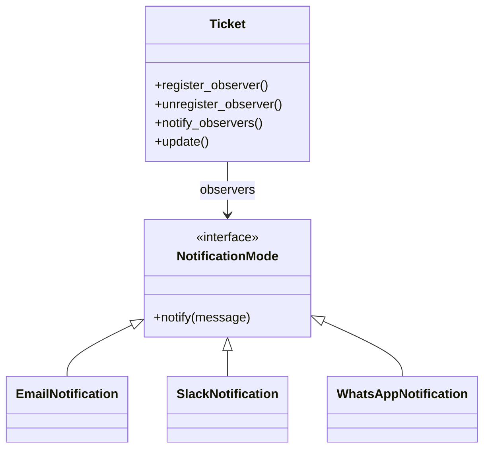

## When to Use

- When one change in an object requires changing others, but you don't know how many objects need to change.
- When an object should notify other objects without knowing who they are.
# Observer Pattern Example

This repository demonstrates the **Observer Pattern** using a ticket notification system as an example.

## What is the Observer Pattern?

The **Observer Pattern** is a behavioral design pattern that allows an object (the **Subject**) to maintain a list of its dependents (the **Observers**) and notify them automatically of any state changes, usually by calling one of their methods.

This pattern is useful when you want to decouple the subject from the observers, allowing you to add, remove, or change observers independently from the subject.

## Key Benefits Illustrated

- **Loose Coupling**: The subject (e.g., `Ticket`) does not need to know the details of any notification mechanism like Email, Slack, WhatsApp, etc. You can add new notification types without modifying the subject.
- **Open/Closed Principle**: The system is open for extension (add new notification types) but closed for modification (no need to change the core subject class).
- **Extensibility**: Observers can be registered or unregistered at runtime, based on user preferences, ticket severity, or other conditions.
- **Reusability**: The observer interface (e.g., `NotificationMode`) can be implemented in other domains such as orders, bugs, or other events.

## Example Structure



## Example Usage

```python
# Create a ticket
ticket = Ticket("Server down")

# Create observers
email = EmailNotification()
slack = SlackNotification()
whatsapp = WhatsAppNotification()

# Register observers
ticket.register_observer(email)
ticket.register_observer(slack)
ticket.register_observer(whatsapp)

# Notify all observers on update
ticket.update("Server maintenance scheduled")
```

## How it Works

1. **Subject (`Ticket`)** keeps a list of observers.
2. **Observers** implement a common interface (`NotificationMode`).
3. When the subject changes (e.g., ticket updated), it **notifies all registered observers**.
4. You can **add or remove observers** at runtime without modifying the subject or existing observers.

